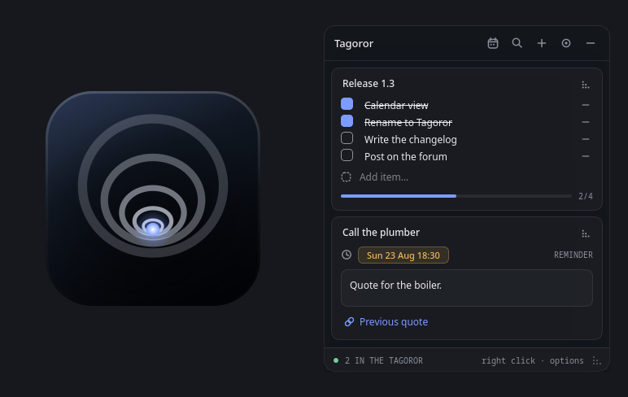
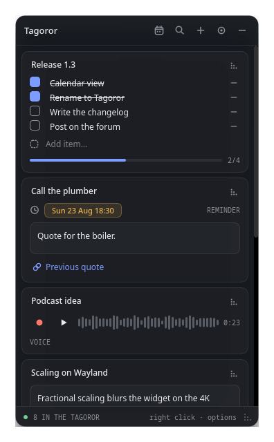
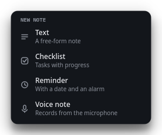
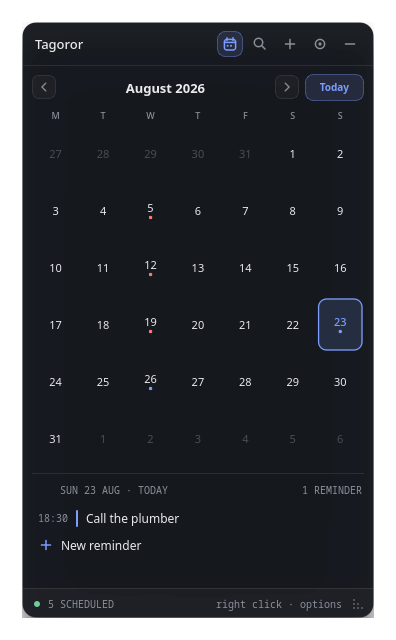
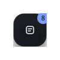
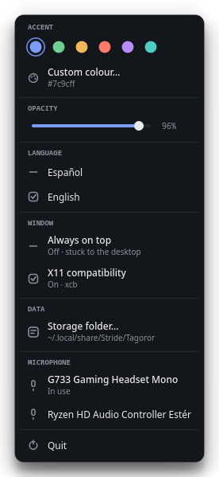

<h1 align="center">Tagoror</h1>

<p align="center">
  A sticky-notes widget for the Linux desktop, written in C++20 with Qt 6.<br>
  Frameless, translucent, and made to sit <em>on</em> the desktop rather than get in
  the way — text notes, checklists, reminders that actually ring (with a month
  view to go with them), voice notes with a waveform, and links you can attach
  to any of them.
</p>

<p align="center">
  
</p>

> A *tagoror* is the circle of stones where the Guanche council met — which is
> what the ring icon is. The app was called **Codex** (*Códice*) until the
> rename; notes from that version are picked up on first run, folder and all,
> so there is nothing to move by hand.

## Features

<p align="center">
  
</p>

### Four kinds of note

| | |
|---|---|
| **Text** | A plain note whose editor grows with the content. |
| **Checklist** | Items you can tick off (done ones get struck through), a progress bar, and an add row that reads as a pending task rather than a form. |
| **Reminder** | A real date, not just a label: when the time comes it rings until you stop it. |
| **Voice** | Records from your microphone and draws the waveform of what you said. |

<p align="center">
  
</p>

### Reminders that actually go off

- Presets (in 5 minutes, in an hour, 18:00, tomorrow at 9:00), a date typed by
  hand, or a day picked on the calendar.
- Click the date chip **or** right-click the note to change it.
- **They can come back every week or every year** — the bin on Thursdays, a
  birthday — from the *Repetir* section of the same date menu. A repeating
  reminder shows a small loop next to its date, says how often it returns where
  the type label goes, and jumps to its next turn as soon as you silence it.
- **A reminder with no details is only its date.** The body editor is not there
  taking up room until you ask for it, with *+ Añadir detalles* under the date
  or the entry in the note's menu.
- Colour tells you the state at a glance: a muted clock while it is still ahead,
  a red bell once the time has passed — whether or not it has already rung.
- When one fires it plays a looping tone until you stop it, from the button on
  the note, the note's menu, or simply by opening the panel.
- Folded away, the dock itself turns into a red bell, so an alarm is visible
  even when the panel is not.

### A month view for them

<p align="center">
  
</p>

- The calendar button in the header swaps the note list for a month grid; the
  same button swaps back.
- Every reminder shows up as a dot on its day, coloured one by one: accent for
  what is still ahead, red for what has passed. A repeating one is on **all** of
  its days, past ones included, so browsing back a year still shows the
  birthday; a turn that is simply over is not painted as overdue.
- Pick a day to list its reminders by time, click one to jump to its note, or
  add a new one straight from the day — a preset hour or a time you type.
- Reminders with a free-text date have no instant to place, so they stay in the
  list and out of the grid.
- The month moves with the arrows, the mouse wheel, or **Hoy** to come back.
- Each entry shows its time, a bar in the colour of its state, and — once it is
  past due — a `VENCIDO` tag, or a stop button while it is actually ringing.
- **The day's list folds away**, from the arrow on its header or the whole
  header row, and folds itself when the panel gets too short for the month grid
  and the list to share the space. Growing the window again brings back a list
  that folded on its own, but never one you folded on purpose.

### Voice notes

- Records 16-bit PCM WAV straight from the microphone.
- The waveform is drawn **while you record**, so a muted or wrongly-routed
  microphone is visible immediately instead of leaving you with a silent file.
- If a take comes out with no audible signal, the note says so.
- Click anywhere on the waveform to seek; the played part fills with the accent
  colour.
- The input device is selectable, and falls back to the system default if the
  one you picked is gone.

### Links on any note

- Attach a link from the note's right-click menu: an address, and optionally a
  name to show instead of it.
- An address typed without a scheme gets `https://` put in front of it.
- They appear under the body, above the type label, and open in your browser
  with a click. Right-click one to open, copy, rename, or remove it.
- A long address is shortened with an ellipsis rather than pushing the card
  wider than the panel.
- The search filter looks inside link names and addresses too.

### Images on any note

- Attach images from the note's right-click menu; they are **copied** next to
  your notes, so moving or deleting the original does not empty the note, and
  changing the storage folder takes them along.
- They are scaled to the width of the card — never the other way round — and
  cropped to a sensible height rather than stretched.
- **The whole strip folds**, per note, from the header above it (`3 IMÁGENES`)
  or from the note's menu; a folded note does not even load them.
- Click one to open it in your image viewer, right-click it to open or remove it.

### Cards in the order you want

- Every card has a grip in its top-right corner: drag it and the card moves
  through the list, which scrolls along when you reach its edges.
- Or move a card one step at a time with *Subir* / *Bajar* in its menu.
- The order you see is the order that gets saved.

### The window

- **Lives on the desktop** by default, below other windows. "Always on top" is
  an option, not the default.
- Drag it by its header, resize it from the bottom-right corner, or fold it into
  a dock you can also drag around.
- The panel opens *away* from the nearest screen edge: a dock on the right side
  opens to the left, one near the bottom opens upwards. Folding is the mirror
  image, so the dock appears on the corner the panel will reopen from and
  unfolding lands on exactly the same pixels.
- That last part needs the application to be allowed to place its own window,
  which Wayland does not permit — there it always opens down and to the right.
- Frameless and translucent, with adjustable opacity.

<p align="center">
  
  &nbsp;&nbsp;&nbsp;
  
</p>

### Look and feel

- Accent colour from a swatch or any hex value you type, plus an opacity slider.
- Every menu is drawn by the app itself — no native `QMenu` — so right-clicking
  a note gives you the note's own options instead of a cut/copy/paste menu.
- No image assets at all: the icons are drawn with `QPainter` and the alarm tone
  is synthesised on first use.

### Other

- Filter notes as you type — titles, bodies, checklist items and links.
- An empty panel offers a button to create the first note.
- Everything is saved automatically, a moment after you stop typing.

## Building

Requires **Qt 6** (Widgets and Multimedia), **CMake ≥ 3.25**, **Ninja**, and a
C++20 compiler. Developed against Qt 6.11.

```sh
# Arch / CachyOS
sudo pacman -S qt6-base qt6-multimedia qt6-multimedia-ffmpeg cmake ninja

# Debian / Ubuntu
sudo apt install qt6-base-dev qt6-multimedia-dev cmake ninja-build
```

Then:

```sh
make          # configure + build
make run      # build and launch
make clean
```

Or with CMake directly:

```sh
cmake -B build -G Ninja -DCMAKE_BUILD_TYPE=Release
cmake --build build
./build/tagoror
```

Playback goes through Qt Multimedia's FFmpeg backend, so that plugin has to be
installed — on Arch it ships separately as `qt6-multimedia-ffmpeg`; on Debian it
comes with `qt6-multimedia-dev`.

## Installing as a desktop app

To get it in your application menu instead of running it from a terminal:

```sh
make install          # into ~/.local — no root needed
```

That builds an optimised binary and installs the executable, a `tagoror.desktop`
entry, and the icon at every size. Look for **Tagoror** in your application menu;
the launcher may take a few seconds to notice it the first time, or a logout to
be safe.

```sh
make install PREFIX=/usr/local   # system-wide instead (needs sudo)
make autostart                   # also open it when you log in
make autostart-off               # stop doing that
make uninstall                   # remove it (your notes are kept)
```

The `.desktop` entry records the full path of the installed binary, so it works
whether or not the prefix is on your `PATH`.

Only one copy runs at a time: launching it again while it is already open just
brings the existing panel to the front, so two windows can never fight over the
same `notes.json`.

Notes kept by earlier versions under `Stride/Abyss` or `Stride/NotasWidget` are
moved across automatically the first time you run it, and so is the data folder
you had chosen by hand — a rename must never strand anyone's notes.

## Packaging it for others

Three recipes live under `packaging/`, all of them building the same CMake
project — only the wrapper differs.

### Arch / CachyOS package

```sh
cd packaging/arch
makepkg -si            # builds and installs it through pacman
sudo pacman -R tagoror   # removes every file it installed; your notes stay
```

`PKGBUILD` pulls the tarball of a release tag, so tag and push first
(`git tag -a v1.2 && git push --tags`) and then run `updpkgsums` to replace the
`SKIP` checksum — the AUR does not accept `SKIP` for a plain tarball. `.SRCINFO`
is regenerated with `makepkg --printsrcinfo > .SRCINFO`.

### AppImage

```sh
sh packaging/appimage/build-appimage.sh          # → Tagoror-1.2-x86_64.AppImage
```

One file, Qt included, nothing to install on the other end (~93 MB). It bundles
the xcb platform plugin, the FFmpeg media backend and libxcb.

An AppImage does **not** carry glibc, so it only runs on systems whose glibc is
at least as new as the one it was built against. Built on Arch it will not start
on an Ubuntu LTS — for a release, build it inside an old base instead:

```sh
docker run --rm -v "$PWD:/src" -w /src ubuntu:22.04 \
    sh -c 'apt update && apt install -y qt6-base-dev qt6-multimedia-dev \
           cmake ninja-build g++ libxcb1-dev file wget && \
           sh packaging/appimage/build-appimage.sh'
```

### Windows

Every tag also builds a Windows 11 package on GitHub Actions
(`.github/workflows/windows.yml`): Qt 6.9 with MSVC, `windeployqt`, then Inno
Setup. Two files land on the release:

| | |
|---|---|
| `Tagoror-<version>-setup.exe` | Installs for the current user into `%LOCALAPPDATA%\Programs\Tagoror` — no UAC prompt. Start Menu entry, optional desktop shortcut and *open when I sign in*. Uninstalling leaves your notes alone. |
| `Tagoror-<version>-win64.zip` | The same build, unpacked. Portable: run `tagoror.exe` from anywhere. |

Notes live in `%APPDATA%\Stride\Tagoror\` there, with the same `notes.json` and
`audio\` inside, so a folder copied from Linux works as is.

What differs on Windows:

- The X11 machinery compiles to nothing. `availableGeometry()` really is the
  work area there, so `_NET_WORKAREA` is not needed, and `Qt::Tool` already
  keeps the window out of the taskbar (`WS_EX_TOOLWINDOW`) — which is what the
  `_NET_WM_STATE_SKIP_TASKBAR` request does on X11.
- Settings has no *Compatibilidad X11* row: there is nothing to choose.
- With *always on top* off, the panel sits below other windows, but Windows has
  no "on the desktop" layer, so *Show desktop* hides it along with everything
  else.

To build it on a Windows machine instead, the same CMake project works with
either toolchain:

```powershell
# MSVC + Qt from the official installer
cmake -B build -G "Visual Studio 17 2022" -A x64 -DTAGOROR_VERSION=1.2.0
cmake --build build --config Release
cmake --install build --config Release --prefix dist
windeployqt --release dist\tagoror.exe
```

```sh
# or MSYS2 (UCRT64 shell)
pacman -S mingw-w64-ucrt-x86_64-{qt6-base,qt6-multimedia,cmake,ninja,gcc}
cmake -B build -G Ninja -DCMAKE_BUILD_TYPE=Release && cmake --build build
```

### Flatpak

```sh
flatpak install flathub org.kde.Platform//6.9 org.kde.Sdk//6.9
flatpak-builder --user --install --force-clean build-flatpak \
    packaging/flatpak/io.github.larzt.tagoror.yml
flatpak run io.github.larzt.tagoror
```

The manifest asks for X11 (the panel has to know where it is to fold and unfold
towards the right side, which Wayland does not allow), PulseAudio for the
microphone, the StatusNotifier names for the tray icon, and `--filesystem=home`
because the storage folder can be pointed anywhere.

Flatpak requires the desktop entry, the icons and the AppStream file to be named
after the app ID, so that build passes `-DTAGOROR_APP_ID=io.github.larzt.tagoror`
and CMake renames all of them together. Everywhere else the ID stays `tagoror`.

## Where your notes live

```
~/.local/share/Stride/Tagoror/
├── notes.json     # notes, accent, opacity, window size, preferences
├── alarm.wav      # the generated alarm tone
├── audio/         # one WAV per voice note
└── images/        # the images attached to notes
```

The folder is configurable from settings. Changing it copies the attachments —
voice takes and images — across and leaves the originals where they were, so
nothing is lost if the copy fails.

> The chosen folder lives in `QSettings` (`~/.config/Stride/Tagoror.conf`) and
> not in `notes.json`, since it is what decides where `notes.json` is. That
> means **`XDG_DATA_HOME` on its own does not isolate a test run**: with a
> folder configured, the app follows it and opens your real notes. Point
> `XDG_CONFIG_HOME` somewhere scratch as well.

## Layout

The code is split into three layers, and headers mirror the sources:

```
include/core/    note, paths, store        the data and where it is kept
include/ui/      panel, notecard, calendar, popup, theme, waveform, dragwidgets
include/audio/   recorder, alarm, wave     microphone, alarm tone, WAV
src/             the matching implementations, same folders
packaging/       .desktop template and the rasterised icons
tagoror.svg        app icon
tagoror-small.svg  simplified variant, used below 32px
```

`core` knows nothing about the interface, `ui` never touches the disk — it goes
through `Store`, which owns the notes and the JSON file — and `audio` only deals
with the microphone and WAV files.

The icon ships twice on purpose: the detailed five-ring mark as the scalable
SVG, and the simplified three-ring one rasterised into the small sizes, where
the thin rings would otherwise blur together. `packaging/render-icons.sh`
regenerates the PNGs when either SVG changes.

`wave.hpp` is a small header-only RIFF/WAVE reader and writer — enough for the
16-bit PCM files the app records, and it declines anything else rather than
guessing.

## Licence

Tagoror is released under the **MIT licence** — the full text is in
[`LICENSE`](LICENSE), and every package carries it: on Linux it is installed as
`share/licenses/tagoror/LICENSE` (which is what Arch requires, and what the
AppImage picks up along with everything else), and on Windows it sits next to
`tagoror.exe`, so both the installer and the portable ZIP include it. The
AppStream file declares `MIT` as well, which is what Flathub and the software
centres read.

The interface is built with **Qt 6**, used unmodified under the **LGPL-3.0**
and linked dynamically. The packages that bundle it — the AppImage, the Windows
installer and the ZIP — therefore ship Qt's own libraries next to the binary,
where they can be replaced with a compatible build; Qt's licence texts travel
inside those Qt files. Nothing else is vendored: the icons are drawn with
`QPainter` and the alarm tone is synthesised at runtime, so there are no
third-party assets to attribute.

## Known limitations

- Moving, resizing, and window stacking are delegated to the compositor
  (`startSystemMove` / `startSystemResize`), which is what makes them work on
  Wayland. In exchange, on Wayland "always on top" and "on the desktop" are
  requests the compositor may decline.
- Reminders are checked every 5 seconds, so an alarm can be up to that late.
- It is a utility window by design, so it stays out of the taskbar and the
  alt-tab list. Fold it into the dock instead of minimising it.
- There is no automated test suite yet.
