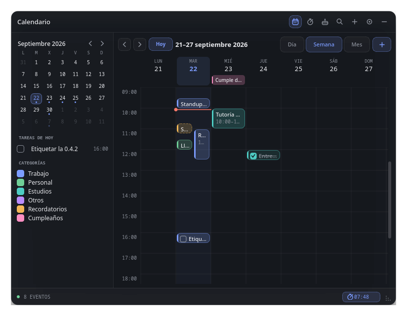
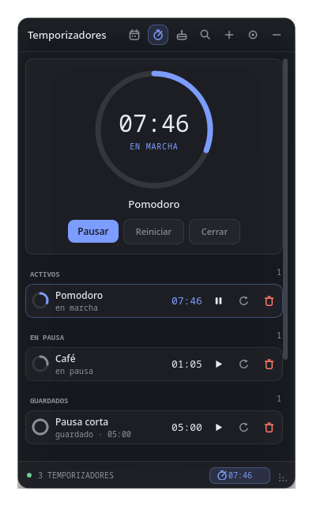
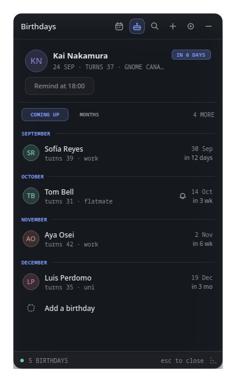
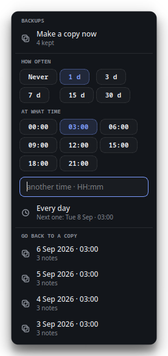
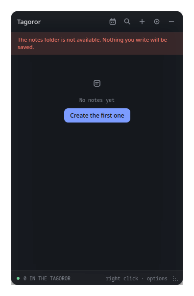

<h1 align="center">Tagoror</h1>

<p align="center">
  A sticky-notes widget for the Linux desktop, written in C++20 with Qt 6.<br>
  Frameless, translucent, and made to sit <em>on</em> the desktop rather than get in
  the way — text notes, checklists, reminders that actually ring (with a month
  view to go with them), birthdays that do not get forgotten, voice notes with a
  waveform, and links you can attach to any of them.<br>
  Your notes are kept where you choose — including a USB stick — and backed up
  on a schedule you set.
</p>

<p align="center">
  <a href="CHANGELOG.md">Changelog</a>
</p>

<p align="center">
  
</p>

> A *tagoror* is the circle of stones where the Guanche council met — which is
> what the ring icon is. The app was called **Codex** (*Códice*) until the
> rename; notes from that version are picked up on first run, folder and all,
> so there is nothing to move by hand.

## Features

<p align="center">
  
</p>

### Four kinds of note

| | |
|---|---|
| **Text** | A note whose editor grows with the content, and that understands **Markdown**: headings, `**bold**`, `*italic*`, `` `code` ``, lists, `- [ ]` checkboxes, quotes and `[links](…)` are shown formatted, and turn back into plain text the moment you click in to edit. Single line breaks stay line breaks, so notes written before this look the same. |
| **Checklist** | Items you can tick off (done ones get struck through) and rename in place, a progress bar, and an add row that reads as a pending task rather than a form. |
| **Reminder** | A real date, not just a label: when the time comes it rings until you stop it. |
| **Voice** | Records from your microphone and draws the waveform of what you said. |

<p align="center">
  
</p>

### Reminders that actually go off

- Presets (in 5 minutes, in an hour, 18:00, tomorrow at 9:00), a date typed by
  hand, or a day and hour picked in the planner.
- Click the date chip **or** right-click the note to change it.
- **They can come back every week or every year** — the bin on Thursdays, a
  birthday — from the *Repetir* section of the same date menu. A repeating
  reminder shows a small loop next to its date, says how often it returns where
  the type label goes, and jumps to its next turn as soon as you silence it.
- **A reminder with no details is only its date.** The body editor is not there
  taking up room until you ask for it, with *+ Añadir detalles* under the date
  or the entry in the note's menu.
- Colour tells you the state at a glance: a muted clock while it is still ahead,
  a red bell once the time has passed — whether or not it has already rung.
- When one fires it plays a looping tone until you stop it, from the button on
  the note, the note's menu, or simply by opening the panel.
- Folded away, the dock itself turns into a red bell, so an alarm is visible
  even when the panel is not.

### A planner for your week

<p align="center">
  
</p>

- The calendar button in the header opens it; the same button goes back. The
  panel **widens while it is open** — a week does not fit in 300 pixels — and
  returns to its size when you leave, unless you resized it in between.
- **Day, week and month views.** Day and week lay things out by the hour, side
  by side when they overlap, with a red line at the current time; month writes
  each day's entries inside its cell, with `+N more` when they do not fit.
- **Events and tasks** with a start and an end, a category (work, personal,
  studies, other) and an optional repeat — every day, week or month. A task has
  a box to tick, and a repeating task is ticked per day, not all at once.
- They can **ring ten minutes before** they start, through the same alarm as
  everything else; a red strip under the header says what is starting and stops
  it.
- Your reminders and birthdays appear on the same grid — reminders as a dashed
  block you can click to jump to the note, birthdays as an all-day tag — and the
  category list on the left hides any of them, reminders and birthdays included.
- Click an empty hour to create something there, or use **+**. The form can
  also create a plain reminder note, which is what the old calendar did when you
  picked a day.
- Events live in `events.json` next to your notes and are backed up with them.
- Narrow the window and the side panel folds away; the grid keeps working.

### Timers

<p align="center">
  
</p>

- From the stopwatch button in the header. Name it if you like, set hours,
  minutes and seconds (or pick 1, 5, 10 or 25 minutes) and it starts.
- A dial shows the one you open; the rest are grouped as *active*, *paused* and
  *saved*. Reset one and it stays as a saved template — a Pomodoro you start
  again tomorrow.
- **Time keeps running with the app closed**: a timer stores when it ends, not
  how much is left, so it rings on the next launch if it ran out meanwhile.
- The countdown of the running one sits in the footer on every page. When it
  reaches zero the alarm plays and a red strip offers **+1 min** or **Stop**.

### Birthdays

<p align="center">
  
</p>

- A page of their own, from the cake button in the header. **The next birthday
  due is highlighted on a card** — whether it falls today or in three months —
  and the rest are listed below.
- Each person has a name, a day, an optional year (without it there is simply no
  *turns 32*) and a free-text relation: *sister*, *work*, *uni*, whatever you
  use to tell two Marías apart.
- **Grouped by month**, so it reads like the list you would write on paper. The
  order is yours: *Coming up* runs from this month forward and wraps round the
  year, *Months* is the plain January-to-December agenda.
- **They can ring.** Give one an hour and it goes off that day through the same
  alarm as a reminder — red dock, red tray icon — until you stop it.
- On the day, the card offers to mark the person as greeted. The mark expires by
  itself at the end of the year, so nothing has to be cleared by hand.
- A 29 February is only ever a 29 February: it waits for the leap year instead
  of quietly sliding to the 28th.
- They are **not** notes with a yearly reminder attached. Twenty birthdays in
  the note list would be twenty cards nobody wants to read there, so they live
  in `birthdays.json` beside your notes — travelling to the USB stick with them
  and backed up alongside them.

### Voice notes

- Records 16-bit PCM WAV straight from the microphone.
- The waveform is drawn **while you record**, so a muted or wrongly-routed
  microphone is visible immediately instead of leaving you with a silent file.
- If a take comes out with no audible signal, the note says so.
- Click anywhere on the waveform to seek; the played part fills with the accent
  colour.
- The input device is selectable, and falls back to the system default if the
  one you picked is gone.

### Links on any note

- Attach a link from the note's right-click menu: an address, and optionally a
  name to show instead of it.
- An address typed without a scheme gets `https://` put in front of it.
- They appear under the body, above the type label, and open in your browser
  with a click. Right-click one to open, copy, rename, or remove it.
- A long address is shortened with an ellipsis rather than pushing the card
  wider than the panel.
- The search filter looks inside link names and addresses too.

### Images on any note

- Attach images from the note's right-click menu; they are **copied** next to
  your notes, so moving or deleting the original does not empty the note, and
  changing the storage folder takes them along.
- They are scaled to the width of the card — never the other way round — and
  cropped to a sensible height rather than stretched.
- **The whole strip folds**, per note, from the header above it (`3 IMÁGENES`)
  or from the note's menu; a folded note does not even load them.
- Click one to open it in your image viewer, right-click it to open or remove it.

### Cards in the order you want

- Every card has a grip in its top-right corner: drag it and the card moves
  through the list, which scrolls along when you reach its edges.
- Or move a card one step at a time with *Subir* / *Bajar* in its menu.
- The order you see is the order that gets saved.

### Backups you can set to your own rhythm

<p align="center">
  
</p>

- From *Settings → Backups*. A copy of your notes and your birthdays is **set
  aside before either is overwritten**, into `backups/` inside your storage
  folder — so the history travels to the USB
  stick along with the notes, and changing the folder carries it across.
- **You decide the rhythm**: never, or every 1, 3, 7, 15 or 30 days, at any
  hour you like — a preset every three hours, or an `HH:mm` you type. The menu
  spells out when the next one falls, so the schedule can be checked rather
  than trusted.
- A scheduled copy is not lost if the app was closed at that hour: it catches
  up on the next launch.
- *Make a copy now* is there for the moment before you do something drastic.
- **Go back to any of them** from the same menu, with its date and how many
  notes it holds. Restoring sets the current state aside as a copy first, so
  picking the wrong one is not the end of it.
- The ten most recent are kept; older ones are pruned.

### It tells you when it cannot save

<p align="center">
  
</p>

- If your storage folder lives on a USB stick, a network share, or anything else
  that may not be there — Tagoror **does not create it and does not seed a fresh
  set of notes**. It says so, in red, under the header, and writes nothing at
  all while the folder is missing.
- When the folder appears it is **picked up on its own** within a few seconds,
  and anything you typed while it was gone is kept, not thrown away.
- Choosing a folder that **already holds notes** asks which you meant: open the
  ones already there, or move these ones over.
- Saving is atomic — written to a temporary file and renamed over the old one —
  so pulling the drive mid-write cannot leave a half-written file behind.

### The window

- **Lives on the desktop** by default, below other windows. "Always on top" is
  an option, not the default.
- Drag it by its header, resize it from the bottom-right corner, or fold it into
  a dock you can also drag around.
- The panel opens *away* from the nearest screen edge: a dock on the right side
  opens to the left, one near the bottom opens upwards. Folding is the mirror
  image, so the dock appears on the corner the panel will reopen from and
  unfolding lands on exactly the same pixels.
- That last part needs the application to be allowed to place its own window,
  which Wayland does not permit — there it always opens down and to the right.
- Frameless and translucent, with adjustable opacity.

<p align="center">
  
</p>

- The header names the page you are on, and **Escape closes any of them** back
  to the note list.

### Settings, on a page of their own

<p align="center">
  
</p>

- Everything in one place, from the gear in the header: the accent colour, the
  opacity, **the text size**, the language, whether the window stays on top,
  where your notes are kept, the backups and which microphone to record from.
- **Text size** comes in four steps, from small to extra large, with a live
  sample underneath. It scales what you write — titles, note bodies, checklist
  items, the planner — and leaves the chrome around it alone, so a larger size
  never pushes the panel wider than it is.
- It used to be a dropdown, and a menu row had nowhere to put a switch, a
  slider and a folder path without becoming a column taller than the panel it
  was covering.
- Backups and the custom accent colour are still menus of their own, reached
  from a button: they are small dialogues with their own flow, not rows.

### It tells you when there is a new version

- Once a day Tagoror asks GitHub for the latest release and, if it is newer than
  the one you are running, says so in a strip under the header. Click it and the
  release page opens in your browser.
- There is a **Check now** button in *Settings → Updates* for when you do not
  want to wait for the daily one.
- **It only asks; it never downloads or installs anything.** On Windows the
  installer upgrades in place — the `AppId` never changes — so there is nothing
  to uninstall first: run the new `-setup.exe` over what you have and your notes
  stay where they are.
- **Along with the Google Drive copy, it is the only thing in the app that uses
  the network**, it is a switch you can see in settings, and turning it off
  stops every request. The Drive copy does nothing until you connect an account.

### Sync between computers through Google Drive

- From *Settings → Google Drive*: **Connect** opens your browser to sign in to
  Google. Every computer where you connect the same account shares the same
  notes, checklists, reminders, planner events and tasks, birthdays and timers,
  voice notes and images, through a `Tagoror` folder in your Drive.
- **It merges, it does not overwrite.** Each note, event, birthday or timer
  remembers when it last changed; when two computers disagree, the newer version
  of *that element* wins, and anything that exists on only one side is added.
  Adding a task on one computer and a timer on the other gives you both on both.
- **Deletions travel too**: delete a note on one computer and it disappears from
  the others, unless someone edited it there after you deleted it — then the
  edit wins.
- It syncs about twenty seconds after you change something, every minute and a
  half to pick up what the others did, and on launch. **Sync now** does it on
  the spot.
- It never merges while you are typing in the panel; it waits until you are
  done, so the list is not rebuilt under your cursor.
- If two computers upload at the same moment, neither loses anything: the one
  that is overwritten in Drive still has its changes locally and puts them back
  on its next pass.
- Only what changed is transferred, and your window size, position and other
  settings of each computer stay on that computer.
- It asks for the narrowest permission Google has (`drive.file`): the app sees
  the files it created and nothing else in your Drive.
- The connection belongs to the computer, not to the notes: it is kept in the
  app's settings, not in `notes.json`, so it does not travel to a USB stick or
  into the backups. **Disconnect** revokes it; your notes stay on the computer
  and in Drive. Local backups are not synced.
- Keep the clocks of your computers right (they normally are): "newer" is
  decided by the time each change was made.
- What is sent where, and what is not, is spelled out in the
  [privacy policy](PRIVACY.md).

#### Setting it up (for whoever builds Tagoror)

Google only lets registered applications ask for access, so a build needs an
OAuth client of its own. Without one Tagoror builds and works as always, and the
Drive row in settings is simply disabled.

1. In the [Google Cloud console](https://console.cloud.google.com/) create a
   project and enable the **Google Drive API** for it.
2. Set up the **OAuth consent screen** (*Google Auth Platform → Branding /
   Audience*): external, with an app name and a support e-mail. Add the scope
   `.../auth/drive.file`. While the app is in *Testing*, only the accounts listed
   as test users can connect **and their access expires after 7 days**; publish
   it (*In production*) to avoid that. `drive.file` is not a sensitive scope, so
   publishing does not require Google's verification.
3. Under *Clients* create an **OAuth client ID** of type **Desktop app** and copy
   its ID and secret. (A desktop client's secret is not really secret — it ships
   inside every binary — but there is no need to publish it either.)
4. The simplest way: copy `google-oauth.mk.example` to `google-oauth.mk`, fill it
   in, and `make` / `make install` / `make appimage` pick it up. That file is in
   `.gitignore` — **the repository is public and these values never go in it**.
   Or pass both when configuring, as CMake variables or environment variables:

   ```sh
   cmake -B build -DTAGOROR_GOOGLE_CLIENT_ID=1234-abc.apps.googleusercontent.com \
                  -DTAGOROR_GOOGLE_CLIENT_SECRET=GOCSPX-...
   ```

   In GitHub Actions, add them as repository secrets named
   `TAGOROR_GOOGLE_CLIENT_ID` and `TAGOROR_GOOGLE_CLIENT_SECRET`; the release
   workflows already pass them to the AppImage and Windows builds.

### Look and feel

- Accent colour from a swatch or any hex value you type, plus an opacity slider.
- The interface speaks **Spanish or English**, chosen in settings and remembered
  — dates included, which follow the setting rather than the system.
- Every menu is drawn by the app itself — no native `QMenu` — so right-clicking
  a note gives you the note's own options instead of a cut/copy/paste menu.
- No image assets at all: the icons are drawn with `QPainter` and the alarm tone
  is synthesised on first use.

### Keyboard

- **Tab** goes through everything that can be clicked: the header buttons, each
  note's title and body, checklist boxes, link rows, the date chip, the settings
  switches and swatches, the timers, and the blocks of the planner one by one.
- **Enter** or **Space** activates what has the focus; arrows move through the
  items of any menu and through the days of the planner's month; **Escape**
  closes a form, then the page.
- The focus is marked with a ring in the accent colour — only when it got there
  from the keyboard, so clicking with the mouse leaves no ring behind.

### Other

- Filter notes as you type — titles, bodies, checklist items and links.
- An empty panel offers a button to create the first note.
- Everything is saved automatically, a moment after you stop typing — and a
  copy of the previous file is kept on the schedule you choose.
- The settings page shows which version you are running.

## Building

Requires **Qt 6** (Widgets and Multimedia), **CMake ≥ 3.25**, **Ninja**, and a
C++20 compiler. Developed against Qt 6.11.

```sh
# Arch / CachyOS
sudo pacman -S qt6-base qt6-multimedia qt6-multimedia-ffmpeg cmake ninja

# Debian / Ubuntu
sudo apt install qt6-base-dev qt6-multimedia-dev cmake ninja-build
```

Then:

```sh
make          # configure + build
make run      # build and launch
make clean
```

Or with CMake directly:

```sh
cmake -B build -G Ninja -DCMAKE_BUILD_TYPE=Release
cmake --build build
./build/tagoror
```

Playback goes through Qt Multimedia's FFmpeg backend, so that plugin has to be
installed — on Arch it ships separately as `qt6-multimedia-ffmpeg`; on Debian it
comes with `qt6-multimedia-dev`.

## Installing as a desktop app

To get it in your application menu instead of running it from a terminal:

```sh
make install          # into ~/.local — no root needed
```

That builds an optimised binary and installs the executable, a `tagoror.desktop`
entry, and the icon at every size. Look for **Tagoror** in your application menu;
the launcher may take a few seconds to notice it the first time, or a logout to
be safe.

```sh
make install PREFIX=/usr/local   # system-wide instead (needs sudo)
make autostart                   # also open it when you log in
make autostart-off               # stop doing that
make uninstall                   # remove it (your notes are kept)
```

The `.desktop` entry records the full path of the installed binary, so it works
whether or not the prefix is on your `PATH`.

Only one copy runs at a time: launching it again while it is already open just
brings the existing panel to the front, so two windows can never fight over the
same `notes.json`.

Notes kept by earlier versions under `Stride/Abyss` or `Stride/NotasWidget` are
moved across automatically the first time you run it, and so is the data folder
you had chosen by hand — a rename must never strand anyone's notes.

## Packaging it for others

Three recipes live under `packaging/`, all of them building the same CMake
project — only the wrapper differs.

### Arch / CachyOS package

```sh
cd packaging/arch
makepkg -si            # builds and installs it through pacman
sudo pacman -R tagoror   # removes every file it installed; your notes stay
```

`PKGBUILD` pulls the tarball of a release tag, so tag and push first
(`git tag -a v1.2 && git push --tags`) and then run `updpkgsums` to replace the
`SKIP` checksum — the AUR does not accept `SKIP` for a plain tarball. `.SRCINFO`
is regenerated with `makepkg --printsrcinfo > .SRCINFO`.

### Graphical installer (double-click)

```sh
sh packaging/installer/make-installer.sh         # → Tagoror-<version>-x86_64-installer.run
```

One file to hand to someone who just wants to double-click it, the way the
Windows setup works. It asks whether to add the menu entry and whether to open
at login, then installs **into your home folder** — no root, no password
prompt:

```
~/.local/opt/Tagoror/tagoror.AppImage    the app, with Qt inside
~/.local/opt/Tagoror/uninstall.sh        removes it again
~/.local/bin/tagoror                     so `tagoror` works in a terminal
~/.local/share/applications/…            the menu entry
~/.local/share/icons/hicolor/…           icons, every size
```

The wizard uses `kdialog`, or `zenity`, or plain terminal prompts — whichever it
finds — and speaks Spanish or English following `LANG`. Your notes are never
touched: not on install, not on update, not on uninstall.

It carries the whole AppImage, so it is about 95 MB and needs nothing installed
on the other end — and it inherits the AppImage's glibc caveat below. If the
file arrives without its executable bit (GitHub downloads drop it), it needs a
`chmod +x` before the double-click works.

### AppImage

```sh
sh packaging/appimage/build-appimage.sh          # → Tagoror-1.2-x86_64.AppImage
```

One file, Qt included, nothing to install on the other end (~93 MB). It bundles
the xcb platform plugin, the FFmpeg media backend and libxcb.

An AppImage does **not** carry glibc, so it only runs on systems whose glibc is
at least as new as the one it was built against. Built on Arch it will not start
on an Ubuntu LTS — for a release, build it inside an old base instead:

```sh
docker run --rm -v "$PWD:/src" -w /src ubuntu:22.04 \
    sh -c 'apt update && apt install -y qt6-base-dev qt6-multimedia-dev \
           cmake ninja-build g++ libxcb1-dev file wget && \
           sh packaging/appimage/build-appimage.sh'
```

### Windows

Every tag also builds a Windows 11 package on GitHub Actions
(`.github/workflows/windows.yml`): Qt 6.9 with MSVC, `windeployqt`, then Inno
Setup. Two files land on the release:

| | |
|---|---|
| `Tagoror-<version>-setup.exe` | Installs for the current user into `%LOCALAPPDATA%\Programs\Tagoror` — no UAC prompt. Start Menu entry, optional desktop shortcut and *open when I sign in*. Uninstalling leaves your notes alone. |
| `Tagoror-<version>-win64.zip` | The same build, unpacked. Portable: run `tagoror.exe` from anywhere. |

Notes live in `%APPDATA%\Stride\Tagoror\` there, with the same `notes.json` and
`audio\` inside, so a folder copied from Linux works as is.

What differs on Windows:

- The X11 machinery compiles to nothing. `availableGeometry()` really is the
  work area there, so `_NET_WORKAREA` is not needed, and `Qt::Tool` already
  keeps the window out of the taskbar (`WS_EX_TOOLWINDOW`) — which is what the
  `_NET_WM_STATE_SKIP_TASKBAR` request does on X11.
- Settings has no *Compatibilidad X11* row: there is nothing to choose.
- With *always on top* off, the panel sits below other windows, but Windows has
  no "on the desktop" layer, so *Show desktop* hides it along with everything
  else.

To build it on a Windows machine instead, the same CMake project works with
either toolchain:

```powershell
# MSVC + Qt from the official installer
cmake -B build -G "Visual Studio 17 2022" -A x64 -DTAGOROR_VERSION=1.2.0
cmake --build build --config Release
cmake --install build --config Release --prefix dist
windeployqt --release dist\tagoror.exe
```

```sh
# or MSYS2 (UCRT64 shell)
pacman -S mingw-w64-ucrt-x86_64-{qt6-base,qt6-multimedia,cmake,ninja,gcc}
cmake -B build -G Ninja -DCMAKE_BUILD_TYPE=Release && cmake --build build
```

### Flatpak

```sh
flatpak install flathub org.kde.Platform//6.9 org.kde.Sdk//6.9
flatpak-builder --user --install --force-clean build-flatpak \
    packaging/flatpak/io.github.larzt.tagoror.yml
flatpak run io.github.larzt.tagoror
```

The manifest asks for X11 (the panel has to know where it is to fold and unfold
towards the right side, which Wayland does not allow), PulseAudio for the
microphone, the StatusNotifier names for the tray icon, and `--filesystem=home`
because the storage folder can be pointed anywhere.

Flatpak requires the desktop entry, the icons and the AppStream file to be named
after the app ID, so that build passes `-DTAGOROR_APP_ID=io.github.larzt.tagoror`
and CMake renames all of them together. Everywhere else the ID stays `tagoror`.

### Cutting a release

**Releases publish themselves.** `.github/workflows/release.yml` runs on every
push to `main`, but the push is not what decides: the version in
`CMakeLists.txt` is. If a tag `vx.y.z` for it already exists, nothing happens —
so ordinary pushes publish nothing. The first push that carries a *new* version
is the release, and the workflow tags it, builds the AppImage, the double-click
installer, the Windows ZIP and the Windows installer, and attaches all four,
with the release notes taken from `CHANGELOG.md`.

So publishing is: bump the version, write the changelog entry, push.

1. `project(tagoror VERSION x.y.z)` in `CMakeLists.txt` — the only place the
   version lives in code, and what the workflow reads. A `build/` tree
   configured earlier keeps the old value cached:
   `cmake -B build -U TAGOROR_VERSION`.
2. A `## [x.y.z]` section at the top of [`CHANGELOG.md`](CHANGELOG.md). The
   release **fails on purpose** if it is missing — a release with no notes
   should not go out — and it fails in the first ten seconds, before anything
   is compiled.
3. `git push`. That is the release.

Three things the workflow deliberately does *not* touch, because they are
published elsewhere and on their own schedule:

- A `<release version="x.y.z" date="…">` **with a description** in
  `packaging/tagoror.metainfo.xml.in` — Flathub rejects an undescribed version.
  Check it with `appstreamcli validate` after substituting the app ID.
- `pkgver` in `packaging/arch/PKGBUILD`, then `updpkgsums` and a regenerated
  `.SRCINFO`. The `PKGBUILD` fetches the tarball of the tag, so it can only be
  updated once the release above exists.
- `tag:` in `packaging/flatpak/io.github.larzt.tagoror.yml`, same reason.

> The version had drifted apart before this was automated: the tags reached
> `v1.3.1` while `CMakeLists.txt`, the `PKGBUILD` and the Flatpak manifest sat
> at `1.2.0`, and one commit called itself `1.4.1` without ever being tagged.
> The workflow reads `CMakeLists.txt` and nothing else, so at least the tag and
> the binaries can no longer disagree.

## Where your notes live

```
~/.local/share/Stride/Tagoror/
├── notes.json     # notes, timers, accent, opacity, window size, preferences
├── birthdays.json # the birthdays
├── events.json    # the planner's events and tasks
├── alarm.wav      # the generated alarm tone
├── audio/         # one WAV per voice note
├── images/        # the images attached to notes
└── backups/       # notes-, birthdays- and events-<timestamp>.json
```

The folder is configurable from settings. Changing it copies the attachments —
voice takes and images — and the backup history across, and leaves the originals
where they were, so nothing is lost if the copy fails. If you point it at a
folder that already has notes in it, you are asked whether to open those or to
move these ones over.

Birthdays are kept apart from the notes, in `birthdays.json`. A folder written
by an earlier version has them inside `notes.json`; they are moved across the
first time 2.0 opens it, and nothing has to be done by hand. The planner's
events follow the same rules in `events.json`.

All three files are written to a temporary file and renamed into place, so an
interrupted write cannot leave one half-finished. Before each scheduled
overwrite the previous set is copied into `backups/` under a single timestamp;
you can restore any of them from *Settings → Backups*, which brings back every
part and sets aside what you have now. A copy made before birthdays or events
existed has no such part, and then the ones you have are left alone rather than
wiped.

> **If the folder is not there, Tagoror does nothing.** Put your notes on a USB
> stick and the app will start before the stick is mounted. It will not create
> the folder, will not seed a fresh set of notes, and will not write a single
> byte — it shows a warning instead and picks the folder up when it appears.
> Older versions did the opposite, and it cost someone their notes.

> The chosen folder lives in `QSettings` (`~/.config/Stride/Tagoror.conf`) and
> not in `notes.json`, since it is what decides where `notes.json` is. That
> means **`XDG_DATA_HOME` on its own does not isolate a test run**: with a
> folder configured, the app follows it and opens your real notes. Point
> `XDG_CONFIG_HOME` somewhere scratch as well.

## Layout

The code is split into three layers, and headers mirror the sources:

```
include/core/    note, birthday, event, timer, paths, store, updater   the data, where it is
                 kept, and the update check
include/ui/      panel, notecard, planner, timers, birthdays, settings, popup,
                 theme, keynav, waveform, dragwidgets
include/audio/   recorder, alarm, wave          microphone, alarm tone, WAV
src/             the matching implementations, same folders
packaging/       .desktop template and the rasterised icons
tagoror.svg        app icon
tagoror-small.svg  simplified variant, used below 32px
```

`core` knows nothing about the interface, `ui` never touches the disk — it goes
through `Store`, which owns the notes, the timers, the birthdays, the events and
their three JSON files — and `audio` only deals with the microphone and WAV files.

The panel is one window with five pages inside it: the note list, the planner,
the timers, the birthdays and the settings. `PlannerView`, `TimerView`,
`BirthdayView` and `SettingsView` are built the same way — each reads from the `Store` and reports
what the user asked for upwards, leaving `Panel` as the only thing that changes
anything or saves.

The icon ships twice on purpose: the detailed five-ring mark as the scalable
SVG, and the simplified three-ring one rasterised into the small sizes, where
the thin rings would otherwise blur together. `packaging/render-icons.sh`
regenerates the PNGs when either SVG changes.

`wave.hpp` is a small header-only RIFF/WAVE reader and writer — enough for the
16-bit PCM files the app records, and it declines anything else rather than
guessing.

## Licence

Tagoror is released under the **MIT licence** — the full text is in
[`LICENSE`](LICENSE), and every package carries it: on Linux it is installed as
`share/licenses/tagoror/LICENSE` (which is what Arch requires, and what the
AppImage picks up along with everything else), and on Windows it sits next to
`tagoror.exe`, so both the installer and the portable ZIP include it. The
AppStream file declares `MIT` as well, which is what Flathub and the software
centres read.

The interface is built with **Qt 6**, used unmodified under the **LGPL-3.0**
and linked dynamically. The packages that bundle it — the AppImage, the Windows
installer and the ZIP — therefore ship Qt's own libraries next to the binary,
where they can be replaced with a compatible build; Qt's licence texts travel
inside those Qt files. Nothing else is vendored: the icons are drawn with
`QPainter` and the alarm tone is synthesised at runtime, so there are no
third-party assets to attribute.

## Known limitations

- Moving, resizing, and window stacking are delegated to the compositor
  (`startSystemMove` / `startSystemResize`), which is what makes them work on
  Wayland. In exchange, on Wayland "always on top" and "on the desktop" are
  requests the compositor may decline.
- Reminders and birthday alarms are checked every 5 seconds, so one can be up
  to that late.
- It is a utility window by design, so it stays out of the taskbar and the
  alt-tab list. Fold it into the dock instead of minimising it.
- There is no automated test suite yet.
